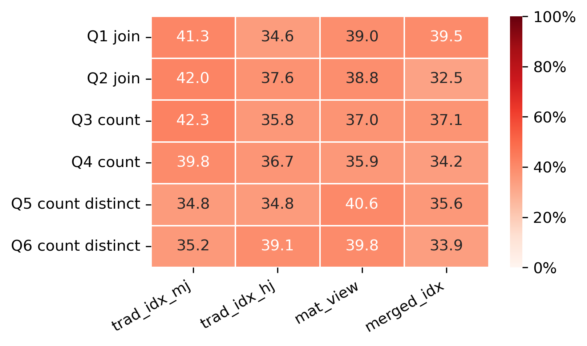
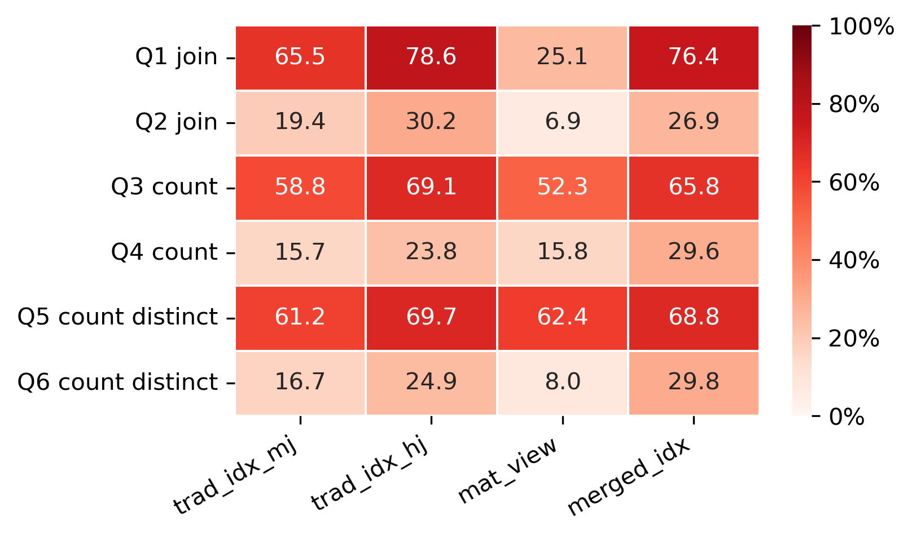

# Artifact for paper "Storing and Indexing Multiple Tables by Interesting Orderings"

## How to reproduce the experiments

VM prerequisites:

- x86_64 CPU with AVX2 support
- 4 CPU cores
- A modern Linux distribution (e.g., Ubuntu 22.04+, Debian 11+, or RHEL 8+). A Linux kernel version of 5.10 or higher. We ran the experiments on Ubuntu 22.04 with Linux kernel 5.15.
- ~10 GiB free RAM
- 20+ GiB free disk
- Network access

Package prerequisites: 

- [Docker](https://docs.docker.com/engine/install/). Run `sudo docker run hello-world` to verify that Docker is installed and working correctly.
- Run `getent group | grep docker`; `docker` group should exist. Then, add the current Linux user to the docker group: `sudo usermod -aG docker $USER; newgrp docker`.
- Python 3 with Pip or [Conda](https://www.anaconda.com/docs/getting-started/miniconda/install#macos-linux-installation)

The following instructions are recommended to be run in a Python virtual environment. (e.g., `conda create -n paper-ready python=3.10; conda activate paper-ready`).

First, run `pip install -r requirements.txt` to install the required Python packages.

Then, simply run `make paper-ready` in the root directory. We recommend running this command in a **screen or tmux session**, as the entire process may take up to 2 hours to complete.
This will trigger a series of commands:

- First, two docker images are pulled from GitHub Container Registry.
- Then, two containers are created from the images and run experiments.
- Finally, plots are generated from the experiment results.

All experiment charts used in the paper will be stored in the `paper-ready` directory. However, the CPU charts used in this README will not be generated; a previous run of CPU stats are included in advance.
The reason is the hassle required of the reviewers to run docker in previleged mode with `kernel.perf_event_paranoid=0` for CPU monitoring.
However, the CPU charts are not central to the claims of the paper and not even included in the paper itself.

Occasionally, LeanStore, due to its nature as a research prototype, may encounter a bug during the experiments, most often with materialized views.
As long as this bug does not happen with RocksDB as well, it stems from the backend, not the experiment code.
If this happens, run `make paper-ready` again to re-run all the experiments.

For details of the implementation of the docker images, including the code for experiments, please refer to [the main repository](https://github.com/alicia-lyu/leanstore) and [the DBToaster repository](https://github.com/alicia-lyu/geodb-dbtoaster).

## Technical Specification

### Experiment Workload Specification

#### Schema and Data Generation

The experimental workload utilizes a synthetic dataset. The schema consists of five relations: `Nation`, `States`, `County`, `City`, and `Customer`.

The geographical hierarchy has a repeated pattern: each child table extends the composite primary key with its local key and declares a foreign key to its parent's composite key. To avoid redundancy, the following snippet shows `Nation`, `States`, and `Customer` in full. `County` and `City` follow the same pattern as `States`, with the obvious key extensions.

```sql
-- Schema Definitions
CREATE TABLE Nation (
    nationkey INT PRIMARY KEY,
    n_name STRING,
    n_comment STRING,
    last_statekey INT
);

CREATE TABLE States (
    nationkey INT,
    statekey INT,
    s_name STRING,
    s_comment STRING,
    last_countykey INT,
    PRIMARY KEY (nationkey, statekey),
    FOREIGN KEY (nationkey) REFERENCES Nation(nationkey)
);

-- County and City follow the same pattern

CREATE TABLE Customer (
    custkey INT PRIMARY KEY,
    nationkey INT,
    statekey INT,
    countykey INT,
    citykey INT,
    c_name STRING,
    c_address STRING,
    c_mktsegment STRING,
    FOREIGN KEY (nationkey, statekey, countykey, citykey)
        REFERENCES City(nationkey, statekey, countykey, citykey)
);
```

Data generation is performed with custom code. It populates these tables with random numbers or characters and maintains referential integrity. For each parent relation, a randomized number of child relations are generated based on configured cardinality parameters.

To simulate realistic data skew, the generator marks specific cities as "hot" candidates with a 1% probability, assigning a disproportionately higher number of customers to these locations.

#### Query and View Definitions

The workload evaluates three categories of queries: multi-table joins, multi-table count aggregations, and multi-table distinct count aggregations. All queries share a common join path connecting all five tables from `Nation` to `Customer`.

##### Multi-table Join Queries (Q1 & Q2)

These queries reconstruct the full hierarchy for a selected range of data. Q1 represents a medium-range scan (filtering by State), while Q2 represents a short-range scan (filtering by County).

```sql
-- Join Queries (Q1 & Q2)
SELECT *
FROM Nation
JOIN States   ON Nation.nationkey  = States.nationkey
JOIN County   ON States.nationkey  = County.nationkey
             AND States.statekey   = County.statekey
JOIN City     ON County.nationkey  = City.nationkey
             AND County.statekey   = City.statekey
             AND County.countykey  = City.countykey
JOIN Customer ON City.nationkey    = Customer.nationkey
             AND City.statekey     = Customer.statekey
             AND City.countykey    = Customer.countykey
             AND City.citykey      = Customer.citykey
WHERE Nation.nationkey = ? AND States.statekey = ?;
-- Q2 adds: AND County.countykey = ?
```

The materialized view for these queries pre-joins all five tables and is indexed by `(nationkey, statekey, countykey, citykey)` to support efficient retrieval.

##### Aggregation Queries (Q3–Q6)

These queries perform grouping on the geographical hierarchy keys. Q3 and Q4 calculate the total number of customers per city, while Q5 and Q6 calculate the number of distinct market segments.

```sql
-- Aggregation Queries (Q3–Q6)
SELECT Nation.nationkey, Nation.n_name,
       States.statekey, States.s_name,
       County.countykey, County.c_name,
       City.citykey, City.ci_name,
       COUNT(*) -- Q5/Q6: change to COUNT(DISTINCT Customer.c_mktsegment)
FROM Nation
JOIN States   ON Nation.nationkey  = States.nationkey
JOIN County   ON States.nationkey  = County.nationkey
             AND States.statekey   = County.statekey
JOIN City     ON County.nationkey  = City.nationkey
             AND County.statekey   = City.statekey
             AND County.countykey  = City.countykey
JOIN Customer ON City.nationkey    = Customer.nationkey
             AND City.statekey     = Customer.statekey
             AND City.countykey    = Customer.countykey
             AND City.citykey      = Customer.citykey
WHERE Nation.nationkey = ? AND States.statekey = ?
-- Q4/Q6 adds: AND County.countykey = ?
GROUP BY Nation.nationkey, Nation.n_name,
         States.statekey, States.s_name,
         County.countykey, County.c_name,
         City.citykey, City.ci_name;
```

We use two materialized views for Q3 and Q4: a join view and an aggregate view. The join view pre-joins all tables except `Customer`. The aggregate view pre-groups the `Customer` table by the geographical keys and calculates the customer count. At query time, a join between the two views produces the final result. The reasoning for using two views is to have the aggregate view over the `Customer` table maintained at a lower cost [gupta1999selection]. Specifically, each update to the `Customer` table only requires an update to the aggregate view, without the need to re-join with the other tables. This is a widely employed strategy, especially for star schema (see "aggregation navigation" [kimball2013data]).

For Q5 and Q6, the materialized view pre-joins all tables except `Customer`. A secondary index is created on the `Customer` table by the geographical keys. At query time, the `Customer` table is first grouped by the geographical keys for calculation of distinct market segment count. This intermediate result is then joined with the pre-joined view to produce the final result. The reason why `COUNT DISTINCT` is not included in the materialized view is that it is not incrementally maintainable and thus would require a full re-computation of the view for each update. This is a standard practice; for example, SQL Server forbids the use of `DISTINCT` in indexed views [indexedviews].

### Additional Experiment Results

#### Difference between B-trees and LSM-trees

The figure below shows the CPU utilization percentage across queries and indexing methods, with B-tree storage and LSM-tree storage.


*With B-tree storage. Different indexing methods consistently utilize 30–45% CPU across 6 queries.*


*With LSM-tree storage. Q1, Q3, and Q5 (range queries) utilize 60–80% CPU, while Q2, Q4, and Q6 (point queries) utilize 5–20% CPU.*

*CPU utilization percentage across queries and indexing methods. While B-tree utilization remains relatively stable and moderate across workloads, LSM-tree storage utilizes CPU heavily for range queries and lightly for point queries.*

We suspect that the reason for LSM-tree's bi-modal CPU utilization (as pointed out in Section "lsm_analysis") is the following. On one hand, the LSM-tree's use of SSTables, which implement compaction and compression, accelerates sequential scans of medium ranges compared with B-trees. On the other hand, point retrievals in an LSM-tree require multiple lookups across the levels (i.e., read amplification), thus it is more IO-intensive than a B-tree.

Their most notable differences in queries and updates between B-trees and LSM-trees are:

- Range queries: Higher CPU utilization of LSM-tree for range queries penalizes disproportionately hash-based query-time execution (`trad_idx_hj`). Meanwhile, it benefits materialized views in a more subtle way—fast range scan offered by LSM-trees alleviates materialized views' disadvantage in scan volume, allowing them to even surpass merged indexes in Q1. In this specific case, the merged index may be occasionally CPU-bound due to record assembly (with 76.4% average CPU utilization), while the materialized view remains IO-bound (with 25.1% average CPU utilization).
- Updates: LSM-trees significantly improve update performance for all methods, but they also pose a penalty for large updates due to compaction and write amplification, which disproportionately affects materialized views.

### Configuration of Leanstore and RocksDB

#### LeanStore

| Flag | Value | Description |
|------|-------|-------------|
| `isolation_level` | `ser` | Serializable isolation |
| `mv` | `false` | Multi-version disabled |
| `vi` | `false` | Version info for multi-versioning disabled |
| `optimistic_scan` | `false` | Optimistic scan disabled (recovering and storing parent pointers in memory) |
| `worker_threads` | `2` | Worker threads |
| `pp_threads` | `1` | Page provider threads (buffer pool management etc) |
| `dram_gib` | `0.1` | DRAM budget (GiB) |

#### RocksDB

All configurations are standard except for the ones listed below.

Total memory budget = 0.1 GiB, split between block cache (80%) and memtable (20%). To enforce the memory budget, `strict_capacity_limit` of block cache is set to `true`, and `cache_index_and_filter_blocks` is set to `true` to count index and filter blocks in the block cache budget.
The memtable budget is further split between write buffers (90%) and WAL (10%).

##### Database Options

| Option | Value | Description |
|--------|-------|-------------|
| `use_direct_reads` | `true` | Bypass OS page cache for reads |
| `use_direct_io_for_flush_and_compaction` | `true` | Direct I/O during compaction/flush |
| `max_background_jobs` | `1` | Single background compaction thread |
| `stats_dump_period_sec` | `1` | Dump statistics every 1 second |

##### Compaction and Compression

| Option | Value | Description |
|--------|-------|-------------|
| `compression` | `kNoCompression` | No compression |
| `compaction_style` | `kCompactionStyleLevel` | Level-based (tiered) compaction |
| `target_file_size_base` | 1 MB | Base SST file target size (RocksDB default: 64 MB) |
| `target_file_size_multiplier` | 2 | File size multiplier per level |

##### Block Cache

| Option | Value | Description |
|--------|-------|-------------|
| Cache type | LRU | Least-recently-used eviction |
| `metadata_block_size` | 64 KB | Metadata block size (RocksDB default: 4 KB) |
| `pin_l0_filter_and_index_blocks_in_cache` | `true` | Pin L0 filter/index blocks |

##### Bloom Filter and Index

| Option | Value | Description |
|--------|-------|-------------|
| `filter_policy` | Bloom filter, `bits_per_key=10` | Per-key bloom filter |
| `index_type` | `kTwoLevelIndexSearch` | Two-level partitioned index |
| `partition_filters` | `true` | Partitioned bloom filters |

##### Memtable

| Option | Value | Description |
|--------|-------|-------------|
| `max_write_buffer_number` | `10` | Max number of unflushed memtables |

## Additional Examples

### Grouping before the joins

Query 1 summarizes the total order price and total invoice due for each customer.
`Customer` is joined on `custkey` with two single-table `COUNT` aggregates over `Orders` and `Invoice`, respectively.
The grouping operations happen before the two binary joins.
Since the grouping key, `custkey`, is the join key of the two binary joins, the joins and grouping operators all require sorting by `custkey`.

**Query 1: Mixed query with aggregation before joins. Customer is joined on `custkey` with two single-table aggregates grouped by `custkey`, one on `Orders` and one on `Invoice`**

```sql
WITH TotalPricePerOrder AS (
    SELECT custkey, SUM(totalprice) AS total_order_price
    FROM Orders
    GROUP BY custkey
), TotalInvoiceDue AS (
    SELECT custkey, SUM(totaldue) AS total_invoice_due
    FROM Invoice
    GROUP BY custkey
)
SELECT c.custkey, c.cust_name, tpo.total_order_price, tid.total_invoice_due
FROM Customer AS c
JOIN TotalPricePerOrder AS tpo ON c.custkey = tpo.custkey
JOIN TotalInvoiceDue AS tid ON c.custkey = tid.custkey
```

A traditional query optimizer may generate a plan with two sort-based grouping operators on `custkey` over `Orders` and `Invoice`, followed by the two merge joins.
The intermediate results from the grouping operators and the first merge join are sorted on `custkey`.
Sort operations are needed only on the base tables.

On the other hand, a merged index storing the primary index of `Customer` and the secondary indexes on `custkey` of `Orders` and `Invoice` embeds this interesting ordering into physical storage.
Both the joins and the grouping operations can consume the merged index without additional sort phases.
In this merged index, each group or cluster corresponds to a customer, containing all their orders and invoices, exactly what the joins and grouping operations require.

<!-- ### Complex updates

-   **Updates with referential integrity check:** When inserting a child record (e.g., an `Order`), the database must verify the existence of the parent (`Customer`). In a merged index, these records are clustered. The check becomes a local seek or a check of the immediately preceding page, rather than a random lookup in a separate structure.
-   **Cascading deletes:** For schemas utilizing `ON DELETE CASCADE`, deleting a parent record implies deleting all children. In a merged index, child records are stored following the parent. A cascading delete operation is a single, efficient range delete operation, rather than multiple random deletions across different indexes. -->

<!-- ### Algorithm for Aggregation Logic of Query 2

See Algorithm 1 for the aggregation logic of Query 2, which counts the number of cities per state and nation. The function `CountCityPerState` takes as input the buffered records during the range scan over an appropriate merged index, and outputs the aggregated result.

**Algorithm 1: Aggregation Logic for Query 2**
```
function CountCityPerState(B):
    i_nation ← 1, i_state ← 2, i_county ← 3, i_city ← 4

    if B[i_nation].IsEmpty() or B[i_state].IsEmpty():
        return empty

    assert B[i_nation].Size() = 1 and B[i_state].Size() = 1
    N ← B[i_nation].First()
    S ← B[i_state].First()
    
    city_count ← B[i_city].Size()

    return { N.nationkey, N.name, S.statekey, S.name, city_count }
``` -->
